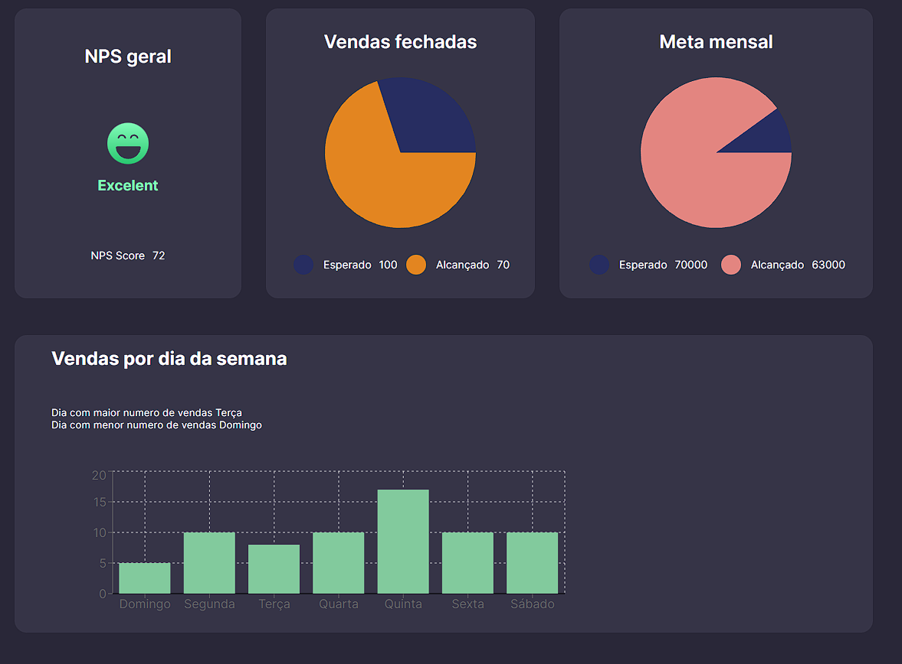

# Projeto Dashboard em React

# **Projeto Dashboard em React**

Este é um projeto de dashboard desenvolvido em React que utiliza diversas tecnologias como Styled Components, JSON-Server, Lodash, Recharts, React-Minimal-Pie-Chart, Vite e Axios. O objetivo desse dashboard é mostrar informações de negócio em tempo real para tomada de decisões.

## **Tecnologias utilizadas**

- React
- Styled Components
- JSON-Server
- Lodash
- Recharts
- React-Minimal-Pie-Chart
- Vite
- Axios

## **Como executar o projeto**

1. Faça o clone do repositório em sua máquina
2. Na pasta do projeto, execute o comando **`npm install`** para instalar todas as dependências
3. Execute o comando **`npm run start`** para iniciar o servidor local e abrir o dashboard em seu navegador

## **Como usar o JSON-Server**

O JSON-Server é uma ferramenta para criar uma API fake utilizando um arquivo JSON. No projeto, utilizamos o JSON-Server para simular uma API que fornecerá os dados para o dashboard.

Para utilizar o JSON-Server, siga os seguintes passos:

1. Na pasta do projeto, execute o comando **`npm install -g json-server`** para instalar globalmente o JSON-Server
2. Execute o comando **`json-server --watch db.json --port 3001`** para iniciar o servidor do JSON-Server
3. Acesse **`http://localhost:3001`** para verificar se o servidor está funcionando corretamente e para acessar os dados do arquivo **`db.json`**

## **Como customizar o projeto**

O projeto utiliza o Styled Components para estilização. Para modificar o estilo do dashboard, basta acessar as pastas **`components`** e **`styles`** e editar os arquivos CSS.

## **Licença**

Este projeto está sob a licença MIT. Veja o arquivo **`LICENSE`** para mais informações.

